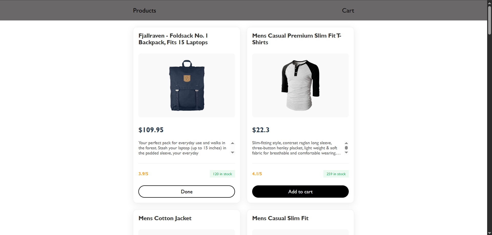
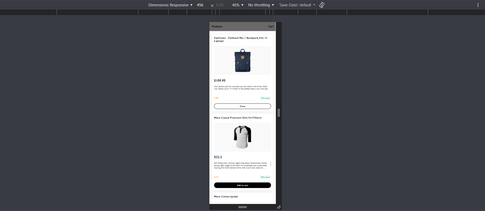

# Мини Маркетплейс

**Имя:** Shaxzod Xalimov  

## Время на выполнение потрачено
~ 10 часов

## Представило Трудности
- Связка Vanilla JS c React корзиной по единому html файлу во время интеграции
- синхронизация useEffect() c localStorage 
- Промежуточные логические проблемы в разгрузке товаров в каталог

## Скриншоты

